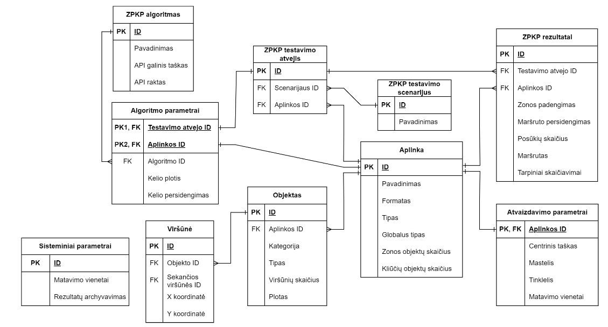
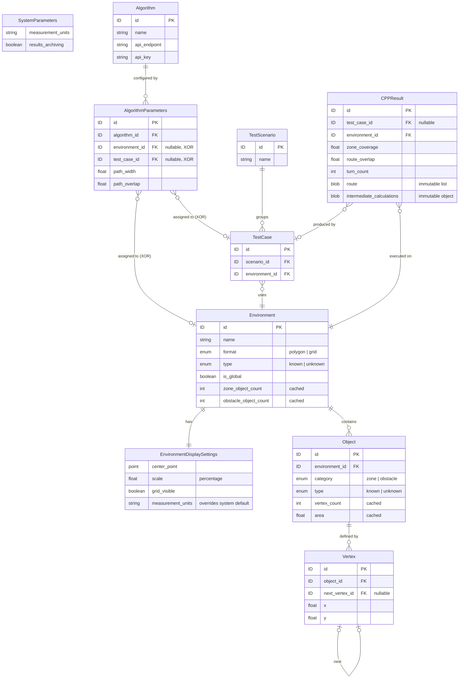

# Logical Database Schema

> **Purpose:** AI-agent-ready specification of the logical database structure.
> Translated from the original Lithuanian requirements document.

## Overview

The system's data model is organized around **four core domains**:

1. **Environment** — spatial workspaces containing geometric objects (zones and obstacles)
2. **Algorithm** — external CPP (Coverage Path Planning) computation endpoints
3. **CPP Test Scenario** — grouped test cases for batch CPP execution
4. **System Parameters** — global configuration

---

## Entities

### System Parameters

Global configuration that applies system-wide.

| Field | Type | Description |
|-------|------|-------------|
| `measurement_units` | string / enum | System-level measurement units used throughout the application |
| `results_archiving` | boolean | Controls whether CPP results are archived to the database for later review and export |

---

### Environment

A spatial workspace that contains geometric objects. Each environment has its own display settings.

| Field | Type | Description |
|-------|------|-------------|
| `id` | ID | Primary key |
| `name` | string | User-provided name |
| `format` | enum: `polygon` \| `grid` | Shape format of the environment |
| `type` | enum: `known` \| `unknown` | Whether the environment layout is known or unknown |
| `is_global` | boolean | Global type flag |
| `zone_object_count` | integer | **Cached.** Precomputed count of zone-category objects (reduces DB read operations) |
| `obstacle_object_count` | integer | **Cached.** Precomputed count of obstacle-category objects (reduces DB read operations) |

#### Environment Display Settings

Per-environment rendering/viewport configuration. One-to-one relationship with Environment.

| Field | Type | Description |
|-------|------|-------------|
| `center_point` | point (x, y) | Center of the environment viewport window |
| `scale` | percentage (float) | Zoom level of the viewport |
| `grid_visible` | boolean | Toggles the helper grid overlay |
| `measurement_units` | string / enum | Defaults to system-level units; can be overridden per environment |

---

### Object

A geometric shape belonging to an Environment. Objects are categorized as **zones** (areas to cover) or **obstacles** (areas to avoid).

| Field | Type | Description |
|-------|------|-------------|
| `id` | ID | Primary key |
| `environment_id` | FK -> Environment | Parent environment this object belongs to |
| `category` | enum: `zone` \| `obstacle` | Whether this object is a coverage zone or an obstacle |
| `type` | enum: `known` \| `unknown` | Whether the object's geometry is known or unknown |
| `vertex_count` | integer | **Cached.** Precomputed vertex count |
| `area` | float | **Cached.** Precomputed area value |

---

### Vertex

A single coordinate point belonging to an Object. Vertices form the polygon boundary of their parent object and are ordered via a linked-list pointer.

| Field | Type | Description |
|-------|------|-------------|
| `id` | ID | Primary key |
| `object_id` | FK -> Object | Parent object this vertex belongs to |
| `next_vertex_id` | FK -> Vertex (nullable) | Pointer to the next vertex in sequence (linked-list ordering) |
| `x` | float | X coordinate |
| `y` | float | Y coordinate |

---

### Algorithm

An external CPP computation service. API credentials allow the system to connect to external services that perform path planning calculations.

| Field | Type | Description |
|-------|------|-------------|
| `id` | ID | Primary key |
| `name` | string | Algorithm display name |
| `api_endpoint` | string | External API endpoint URL |
| `api_key` | string | API authentication key |

---

### Algorithm Parameters

Configurable CPP parameters stored **separately** from the Algorithm itself so they can be individually assigned to either an Environment or a Test Case. This table functions as an extension of both the Environment and Test Case tables.

| Field | Type | Description |
|-------|------|-------------|
| `id` | ID | Primary key |
| `algorithm_id` | FK -> Algorithm | The algorithm these parameters belong to |
| `environment_id` | FK -> Environment (nullable) | **XOR** with `test_case_id` — links parameters to an environment |
| `test_case_id` | FK -> TestCase (nullable) | **XOR** with `environment_id` — links parameters to a test case |
| `path_width` | float | Width of the coverage path |
| `path_overlap` | float | Overlap between adjacent coverage paths |

> **Constraint:** A record must reference **either** an Environment **or** a Test Case, never both simultaneously.
>
> When linked to an Environment, the algorithm and its parameters are used when the user triggers the **"Initialize CPP"** action.

---

### CPP Test Scenario

Groups multiple test cases that can be executed together as a batch.

| Field | Type | Description |
|-------|------|-------------|
| `id` | ID | Primary key |
| `name` | string | Scenario name |

---

### CPP Test Case

A single test execution configuration. Connected to a CPP Algorithm via the Algorithm Parameters junction table.

| Field | Type | Description |
|-------|------|-------------|
| `id` | ID | Primary key |
| `scenario_id` | FK -> TestScenario | Parent scenario this test case belongs to |
| `environment_id` | FK -> Environment | Environment used during test execution |

---

### CPP Result

Output data produced by a CPP execution. Results can originate from a test case execution or from a user-initiated CPP run on an environment.

| Field | Type | Description |
|-------|------|-------------|
| `id` | ID | Primary key |
| `test_case_id` | FK -> TestCase (nullable) | Test case that produced this result (null if triggered directly on an environment) |
| `environment_id` | FK -> Environment | Environment used during CPP execution |
| `zone_coverage` | float | Zone coverage metric achieved |
| `route_overlap` | float | Route overlap metric |
| `turn_count` | integer | Number of turns in the generated route |
| `route` | serialized list | **Immutable.** Stored as a single serialized list — cannot be partially modified |
| `intermediate_calculations` | serialized object | **Immutable.** Stored as a single object blob — cannot be partially modified |

---

## Archival Behavior

When results archiving is enabled and triggered, the system creates **deep copies** of:

- **CPP Results**
- **Environment** (including all child Objects and their Vertices)
- **CPP Test Scenario** (including all child Test Cases)
- **Algorithm** data

All copies receive **new IDs from a dedicated archival ID series**. This ensures that subsequent modifications to the live data do not corrupt or overwrite the archived historical snapshot.

---

## Relationships Summary

| Relationship | Cardinality | Notes |
|---|---|---|
| Environment -> Object | 1 : N | An environment contains many objects |
| Object -> Vertex | 1 : N | An object is defined by many vertices |
| Vertex -> Vertex | 0..1 : 0..1 | Linked-list pointer (`next_vertex_id`) for ordering |
| Environment -> Display Settings | 1 : 1 | Each environment has exactly one display configuration |
| Algorithm -> Algorithm Parameters | 1 : N | An algorithm can have many parameter configurations |
| Algorithm Parameters -> Environment | N : 0..1 | XOR — parameters link to an environment **or** a test case |
| Algorithm Parameters -> Test Case | N : 0..1 | XOR — parameters link to a test case **or** an environment |
| Test Scenario -> Test Case | 1 : N | A scenario groups many test cases |
| Test Case -> Environment | N : 1 | Each test case references one environment |
| CPP Result -> Test Case | N : 0..1 | Results may originate from a test case |
| CPP Result -> Environment | N : 1 | Results always reference the environment used |

---

## Entity-Relationship Diagram

