# Physical Database Schema

> **Storage engine:** IndexedDB via [Dexie.js](https://dexie.org/)  
> **Database name:** `blade-terminal`  
> **Schema version:** 1 (single-version policy — no migration history; clear IndexedDB to apply schema changes)  
>
> **Conventions used in this document**
> - `PK` — primary key (compound where noted; Dexie compound keys use `[col+col]` syntax)
> - `IDX` — non-unique index
> - `AUTO` — auto-incremented by Dexie (`++id`)
> - `FK →` — logical foreign key (IndexedDB has no enforced FK constraints; cascades are handled in application code)
> - `JSON` — value stored as a serialized JSON string
> - *Cached* — value is precomputed and stored redundantly to avoid repeated scans

---

## Table Index

| Table | PK | Purpose |
|---|---|---|
| [`appEnumSetup`](#appEnumSetup) | `[enumGroup+value]` | Seed enum lookup catalog |
| [`environments`](#environments) | `id` | Spatial workspaces |
| [`objects`](#objects) | `[id+environmentId]` | Polygon objects within an environment |
| [`computationSelection`](#computationSelection) | `environmentId` | Active provider/algorithm selection per environment |
| [`computationProviders`](#computationProviders) | `id` AUTO | External CPP service connections |
| [`computationProviderAlgorithms`](#computationProviderAlgorithms) | `[id+computationProviderId]` | Algorithms exposed by a provider |
| [`computationAlgorithmParametersSetup`](#computationAlgorithmParametersSetup) | `[id+algorithmId+computationProviderId]` | Parameter metadata fetched from a provider |
| [`algorithmMetricsSetup`](#algorithmMetricsSetup) | `[id+algorithmId+computationProviderId]` | Metric metadata fetched from a provider |
| [`computationAlgorithmParameters`](#computationAlgorithmParameters) | `[id+algorithmId+providerId+environmentId]` | Per-environment parameter values |
| [`computeResults`](#computeResults) | `environmentId` | Latest CPP result per environment |
| [`layersSetup`](#layersSetup) | `[id+algorithmId+providerId]` | Layer catalog (system + provider) |
| [`layerSettingsSetup`](#layerSettingsSetup) | `[id+layerId+algorithmId+providerId]` | Layer style attribute metadata templates |
| [`layerSettings`](#layerSettings) | `[id+layerId+algorithmId+providerId+environmentId]` | Per-environment working layer style values |
| [`uiPreferences`](#uiPreferences) | `key` | Freeform UI preference store |

---

## Tables

### `appEnumSetup`

Seed-only lookup table. Populated once on `populate` event. Provides display labels for enum fields used across the application.

**Seeded values at DB init:**

| `enumGroup` | `value` | `label` |
|---|---|---|
| `format` | `polygon` | Polygon |
| `format` | `grid` | Grid |
| `type` | `offline` | Off-Line |
| `type` | `online` | On-Line |
| `coordsystem` | `decimal` | Cartesian |
| `coordsystem` | `latlong` | Geographic |

| Column | Type | Constraints | Description |
|---|---|---|---|
| `enumGroup` | `string` | PK (part 1) | Group identifier: `"format"` \| `"type"` \| `"coordsystem"` |
| `value` | `string` | PK (part 2) | Machine-readable enum value |
| `label` | `string` | — | Human-readable display label |

**Indexes:** `enumGroup` (IDX)

---

### `environments`

A spatial workspace containing geometric objects (zones and obstacles). Display settings (viewport state) are stored inline as nested fields.

| Column | Type | Constraints | Description |
|---|---|---|---|
| `id` | `number` | PK | Manually assigned integer ID |
| `name` | `string` | IDX | User-provided display name (truncated to `WORKSPACE_NAME_MAX_LENGTH`) |
| `format` | `string` | — | Shape format: `"polygon"` \| `"grid"` |
| `type` | `string` | — | Env type: `"offline"` \| `"online"` \| `"any_offline"` \| `"any_online"` |
| `coordSystem` | `string` | — | Coordinate system: `"Cartesian"` \| `"Geographic"` |
| `zoneCount` | `number` | — | *Cached.* Count of zone-category objects |
| `obstacleCount` | `number` | — | *Cached.* Count of obstacle-category objects |

> **On delete cascade (application-enforced):** deletes all `objects`, `computationAlgorithmParameters`, `computationSelection`, `layerSettings`, and `computeResults` rows for that `environmentId`.

---

### `objects`

A polygon object (zone or obstacle) belonging to an environment. Vertices are stored inline as an ordered array (not a separate vertices table). Winding order convention: zones → clockwise; obstacles → counter-clockwise (screen coordinates, Y-down).

| Column | Type | Constraints | Description |
|---|---|---|---|
| `id` | `number` | PK (part 1) | Local sequential ID within the environment |
| `environmentId` | `number` | PK (part 2), IDX, FK → `environments.id` | Parent environment |
| `category` | `string` | — | `"zone"` \| `"obstacle"` |
| `type` | `string` | — | Object type: `""` \| `"offline"` \| `"online"` |
| `vertexCount` | `number` | — | *Cached.* Number of vertices |
| `area` | `number` | — | *Cached.* Polygon area (shoelace formula) |
| `vertices` | `Array<{x: number, y: number}>` | — | Ordered polygon vertices in draw order (inline; not indexed) |

---

### `computationSelection`

Stores the currently selected provider and algorithm for each environment. One row per environment; upserted on every change.

| Column | Type | Constraints | Description |
|---|---|---|---|
| `environmentId` | `number` | PK, FK → `environments.id` | Parent environment |
| `selectedProviderId` | `number \| null` | — | FK → `computationProviders.id` (nullable when nothing is selected) |
| `selectedAlgorithmId` | `number \| null` | — | FK → `computationProviderAlgorithms.id` within the selected provider (nullable) |

---

### `computationProviders`

External CPP computation services. Credentials and metadata fetch state are stored here.

| Column | Type | Constraints | Description |
|---|---|---|---|
| `id` | `number` | PK, AUTO | Auto-incremented integer |
| `name` | `string` | IDX | User-provided display name |
| `url` | `string` | — | Base URL of the external service |
| `apiKey` | `string` | — | API authentication key |
| `metadataFetchedAt` | `number \| null` | — | Unix timestamp (ms) of the last successful metadata fetch; `null` when never fetched |
| `urlAtLastFetch` | `string \| null` | — | Provider URL at the time of the last metadata fetch; used for stale-detection |

> **On delete cascade (application-enforced):** deletes all `computationProviderAlgorithms`, `computationAlgorithmParametersSetup`, `layersSetup`, `layerSettingsSetup`, and `layerSettings` rows for that `providerId`.

---

### `computationProviderAlgorithms`

CPP algorithms exposed by a provider. Fetched and replaced atomically when provider metadata is refreshed. IDs are assigned sequentially (1-based) within each provider.

| Column | Type | Constraints | Description |
|---|---|---|---|
| `id` | `number` | PK (part 1) | Sequential ID within the provider (1-based) |
| `computationProviderId` | `number` | PK (part 2), IDX, FK → `computationProviders.id` | Parent provider |
| `name` | `string` | — | Algorithm display name |

**Indexes:** `computationProviderId` (IDX), `[id+computationProviderId]` (compound IDX)

> **On delete cascade (application-enforced):** deletes all `computationAlgorithmParametersSetup` rows for that `[algorithmId+computationProviderId]` pair.

---

### `computationAlgorithmParametersSetup`

Parameter metadata for a provider's algorithm. This is the template table — it holds the schema definition fetched from the provider, from which per-environment `computationAlgorithmParameters` values are initialized.

| Column | Type | Constraints | Description |
|---|---|---|---|
| `id` | `number` | PK (part 1) | Sequential ID within the algorithm (from provider metadata) |
| `algorithmId` | `number` | PK (part 2), IDX, FK → `computationProviderAlgorithms.id` | Parent algorithm |
| `computationProviderId` | `number` | PK (part 3), IDX, FK → `computationProviders.id` | Parent provider |
| `name` | `string` | — | Parameter display name |
| `paramType` | `string` | — | `"Integer"` \| `"Decimal"` \| `"Boolean"` \| `"String"` \| `"Enum"` |
| `enumValues` | `string[]` | — | Allowed values (populated only when `paramType = "Enum"`) |
| `defaultValue` | `string` | — | Serialized string default value; empty string when unset |
| `minValue` | `number \| undefined` | — | Minimum numeric value (only meaningful for `Integer` and `Decimal`) |
| `section` | `string \| undefined` | — | Provider-defined section label for grouping in UI; defaults to `"General"` |
| `appHandler` | `string \| null` | — | Optional application-level behavior handler key for enum params |

**Indexes:** `algorithmId` (IDX), `computationProviderId` (IDX), `[algorithmId+computationProviderId]` (compound IDX)

---

### `algorithmMetricsSetup`

Metric metadata for a provider's algorithm. Fetched alongside parameters during metadata refresh.

| Column | Type | Constraints | Description |
|---|---|---|---|
| `id` | `number` | PK (part 1) | Sequential ID within the algorithm (from provider metadata) |
| `algorithmId` | `number` | PK (part 2), IDX, FK → `computationProviderAlgorithms.id` | Parent algorithm |
| `computationProviderId` | `number` | PK (part 3), IDX, FK → `computationProviders.id` | Parent provider |
| `name` | `string` | — | Metric display name |
| `type` | `string` | — | `"Single-value"` \| `"Time-series"` (open string for forward-compat) |
| `group` | `string \| undefined` | — | Optional grouping label for the metrics panel |
| `style` | `{xAxisLabel?: string, yAxisLabel?: string} \| undefined` | — | Optional time-series chart axis labels (stored inline as sub-object) |

**Indexes:** `algorithmId` (IDX), `computationProviderId` (IDX), `[algorithmId+computationProviderId]` (compound IDX)

---

### `computationAlgorithmParameters`

Per-environment working parameter values. Initialized from `computationAlgorithmParametersSetup` defaults when an algorithm is first selected for an environment. Each row stores the current value for one parameter within one environment.

| Column | Type | Constraints | Description |
|---|---|---|---|
| `id` | `number` | PK (part 1) | Matches `computationAlgorithmParametersSetup.id` |
| `algorithmId` | `number` | PK (part 2), FK → `computationProviderAlgorithms.id` | Parent algorithm |
| `providerId` | `number` | PK (part 3), FK → `computationProviders.id` | Parent provider |
| `environmentId` | `number` | PK (part 4), IDX, FK → `environments.id` | Parent environment |
| `value` | `string` | — | Serialized string value (any param type serialized to string) |

**Indexes:** `[algorithmId+providerId+environmentId]` (compound IDX), `environmentId` (IDX)

---

### `computeResults`

Stores the latest CPP computation result per environment. One row per environment; replaced on every successful compute run.

| Column | Type | Constraints | Description |
|---|---|---|---|
| `environmentId` | `number` | PK, FK → `environments.id` | Parent environment |
| `jobId` | `string` | — | Provider job identifier |
| `algorithmId` | `number` | — | Algorithm used to produce this result |
| `providerId` | `number` | — | Provider that executed the computation |
| `algorithmName` | `string` | — | De-normalized algorithm name (snapshot at compute time) |
| `completedAt` | `string` | — | ISO 8601 timestamp of when the job completed |
| `result` | `ComputeResult` | — | Full serialized result object (see sub-structure below) |

**`result` sub-structure (stored as a single serialized blob — immutable; never partially updated):**

```
result: {
  coveragePathPlan: {
    segments: Array<{
      id: number,
      type: "coverage" | "transit" | string,
      path: Array<{
        id: number,
        point: { x: number, y: number }
      }>
    }>
  },
  debug?: {
    layers: Array<{
      id: number,
      source: string,
      list: unknown[]
    }>
  },
  performance?: {
    metrics: Array<{
      id: number,
      value: number | number[]
    }>
  }
}
```

---

### `layersSetup`

Layer catalog. System layers (grid, polygon objects group) are seeded on `populate` with `algorithmId: 0, providerId: 0` as sentinels. Provider layers are fetched and replaced atomically during metadata refresh.

| Column | Type | Constraints | Description |
|---|---|---|---|
| `id` | `number` | PK (part 1) | Layer definition ID (natural key from registry or provider metadata) |
| `algorithmId` | `number` | PK (part 2), IDX | `0` for system layers; FK → `computationProviderAlgorithms.id` for provider layers |
| `providerId` | `number` | PK (part 3), IDX | `0` for system layers; FK → `computationProviders.id` for provider layers |
| `key` | `number` | IDX | Equals `id` for system layers; provider layers may differ. Used as the stable reference identifier in `layerSettings` |
| `label` | `string` | — | Display name |
| `computeLayer` | `string \| undefined` | — | Algorithm-specific channel key for extracting result data (e.g. `"coveragePathPlan"`) |
| `type` | `string \| undefined` | — | `"Polygon"` \| `"Point"` \| `"Line"` \| `"Grid"` \| `"ObjectGroup"` |
| `placeholder` | `boolean \| undefined` | — | When `true`, this layer is a UI placeholder and does not render |

**Indexes:** `algorithmId` (IDX), `providerId` (IDX), `key` (IDX), `[algorithmId+providerId]` (compound IDX)

---

### `layerSettingsSetup`

Style attribute metadata templates for layers. This is the source-of-truth from which per-environment `layerSettings` rows are initialized. System layers are seeded on `populate`; provider layers are written during metadata refresh.

| Column | Type | Constraints | Description |
|---|---|---|---|
| `id` | `number` | PK (part 1) | Attribute ID from provider metadata or system registry |
| `layerId` | `number` | PK (part 2), FK → `layersSetup.key` | Parent layer |
| `algorithmId` | `number` | PK (part 3) | `0` for system layers; FK → `computationProviderAlgorithms.id` for provider |
| `providerId` | `number` | PK (part 4) | `0` for system layers; FK → `computationProviders.id` for provider |
| `key` | `string` | — | Human-readable attribute key (e.g. `"Polygon Fill Color"`, `"Show Vertex IDs"`); doubles as display label |
| `styleType` | `string` | — | Value type: `"Boolean"` \| `"Integer"` \| `"Color"` \| `"Pixels"` \| `"PointShapeEnum"` \| `"StrokeStyleEnum"` \| `"FillStyleEnum"` \| `"OverlapLayoutEnum"` \| `"PlacementEnum"` \| `"FontWeightEnum"` \| `"LineArrowStartEnum"` \| `"LineArrowEndEnum"` \| `"LineArrowMidEnum"` \| `"PointLabelEnum"` \| `"PolygonIDShapeEnum"` |
| `styleGroup` | `string \| undefined` | — | Style subgroup: `"general"` \| `"point"` \| `"line"` \| `"polygon"`. Absent for internal attributes |
| `defaultValue` | `string \| null` | — | Default serialized string value; `null` when no default |
| `enumValues` | `string[] \| undefined` | — | Allowed enum values for `PointLabelEnum` attributes |
| `mapping` | `Array<{value: string, color: string \| null}> \| undefined` | — | Per-value color overrides for `PointLabelEnum` attributes |

**Indexes:** `[layerId+algorithmId+providerId]` (compound IDX), `[algorithmId+providerId]` (compound IDX)

---

### `layerSettings`

Per-environment working copy of layer style attribute values. Initialized by copying from `layerSettingsSetup` when an environment is created or a new provider layer is first activated. Each row stores the current user-set value for one attribute within one environment. `key`, `styleType`, and `styleGroup` are de-normalized from `layerSettingsSetup` to avoid joins at render time.

| Column | Type | Constraints | Description |
|---|---|---|---|
| `id` | `number` | PK (part 1) | Matches `layerSettingsSetup.id` |
| `layerId` | `number` | PK (part 2), FK → `layersSetup.key` | Parent layer |
| `algorithmId` | `number` | PK (part 3) | `0` for system layers; FK → `computationProviderAlgorithms.id` |
| `providerId` | `number` | PK (part 4) | `0` for system layers; FK → `computationProviders.id` |
| `environmentId` | `number` | PK (part 5), IDX, FK → `environments.id` | Parent environment |
| `key` | `string` | — | *De-normalized.* Attribute key from `layerSettingsSetup.key` |
| `styleType` | `string` | — | *De-normalized.* Value type from `layerSettingsSetup.styleType` |
| `styleGroup` | `string \| undefined` | — | *De-normalized.* Style subgroup from `layerSettingsSetup.styleGroup` |
| `value` | `string` | — | Current serialized string value (user-set or default). For `PointLabelEnum`, encoded as `JSON.stringify(Array<{value: string, color: string \| null}>)` |

**Indexes:** `[layerId+algorithmId+providerId+environmentId]` (compound IDX), `[algorithmId+providerId+environmentId]` (compound IDX), `environmentId` (IDX)

---

### `uiPreferences`

Generic key-value store for persistent UI preferences (e.g. sidebar width, last active tab). Values are always JSON-serialized strings.

| Column | Type | Constraints | Description |
|---|---|---|---|
| `key` | `string` | PK | Preference identifier |
| `value` | `string` | — | JSON-serialized value |

---

## ER Diagram

```mermaid
erDiagram
    appEnumSetup {
        string enumGroup PK "compound PK part 1 — format | type | coordsystem"
        string value     PK "compound PK part 2"
        string label        "human-readable display label"
    }

    environments {
        number id          PK "manually assigned"
        string name           "user-provided; max WORKSPACE_NAME_MAX_LENGTH"
        string format         "polygon | grid"
        string type           "offline | online | any_offline | any_online"
        string coordSystem    "Cartesian | Geographic"
        number zoneCount      "cached: count of zone objects"
        number obstacleCount  "cached: count of obstacle objects"
    }

    objects {
        number id            PK "compound PK part 1"
        number environmentId PK "compound PK part 2; FK"
        string category         "zone | obstacle"
        string type             "empty | offline | online"
        number vertexCount      "cached: polygon vertex count"
        number area             "cached: shoelace area"
        json   vertices         "inline Array of {x,y} in draw order"
    }

    computationSelection {
        number environmentId      PK "FK"
        number selectedProviderId    "nullable FK"
        number selectedAlgorithmId   "nullable FK"
    }

    computationProviders {
        number id                PK "AUTO-increment"
        string name                 "user-provided display name"
        string url                  "base URL of external service"
        string apiKey               "API authentication key"
        number metadataFetchedAt    "nullable; unix ms timestamp"
        string urlAtLastFetch       "nullable; URL at last fetch — stale detection"
    }

    computationProviderAlgorithms {
        number id                   PK "compound PK part 1; sequential within provider"
        number computationProviderId PK "compound PK part 2; FK"
        string name                    "algorithm display name"
    }

    computationAlgorithmParametersSetup {
        number id                   PK "compound PK part 1"
        number algorithmId          PK "compound PK part 2; FK"
        number computationProviderId PK "compound PK part 3; FK"
        string name                    "parameter display name"
        string paramType               "Integer | Decimal | Boolean | String | Enum"
        json   enumValues              "allowed values — Enum params only"
        string defaultValue            "serialized default; empty string when unset"
        number minValue                "optional; Integer and Decimal only"
        string section                 "optional; UI grouping label (default: General)"
        string appHandler              "optional nullable; app-level behaviour key"
    }

    algorithmMetricsSetup {
        number id                   PK "compound PK part 1"
        number algorithmId          PK "compound PK part 2; FK"
        number computationProviderId PK "compound PK part 3; FK"
        string name                    "metric display name"
        string type                    "Single-value | Time-series"
        string group                   "optional; panel grouping label"
        json   style                   "optional; {xAxisLabel?, yAxisLabel?}"
    }

    computationAlgorithmParameters {
        number id            PK "compound PK part 1; matches setup id"
        number algorithmId   PK "compound PK part 2; FK"
        number providerId    PK "compound PK part 3; FK"
        number environmentId PK "compound PK part 4; FK"
        string value            "serialized string (all param types)"
    }

    computeResults {
        number environmentId PK "FK — one row per environment"
        string jobId            "provider job identifier"
        number algorithmId      "algorithm used for this result"
        number providerId       "provider that executed the job"
        string algorithmName    "denormalized snapshot at compute time"
        string completedAt      "ISO 8601 completion timestamp"
        json   result           "immutable ComputeResult blob"
    }

    layersSetup {
        number  id           PK "compound PK part 1"
        number  algorithmId  PK "compound PK part 2; 0 = system sentinel"
        number  providerId   PK "compound PK part 3; 0 = system sentinel"
        number  key             "stable reference ID used in layerSettings"
        string  label           "display name"
        string  computeLayer    "optional; result channel key e.g. coveragePathPlan"
        string  type            "Polygon | Point | Line | Grid | ObjectGroup"
        boolean placeholder     "optional; UI placeholder — never renders"
    }

    layerSettingsSetup {
        number id          PK "compound PK part 1"
        number layerId     PK "compound PK part 2; FK → layersSetup.key"
        number algorithmId PK "compound PK part 3; 0 = system"
        number providerId  PK "compound PK part 4; 0 = system"
        string key            "attribute display label e.g. Polygon Fill Color"
        string styleType      "Boolean | Integer | Color | Pixels | *Enum variants"
        string styleGroup     "optional; general | point | line | polygon"
        string defaultValue   "nullable serialized default"
        json   enumValues     "optional; allowed values for PointLabelEnum"
        json   mapping        "optional; [{value, color}] for PointLabelEnum"
    }

    layerSettings {
        number id            PK "compound PK part 1"
        number layerId       PK "compound PK part 2; FK → layersSetup.key"
        number algorithmId   PK "compound PK part 3; 0 = system"
        number providerId    PK "compound PK part 4; 0 = system"
        number environmentId PK "compound PK part 5; FK"
        string key              "denormalized from layerSettingsSetup.key"
        string styleType        "denormalized from layerSettingsSetup.styleType"
        string styleGroup       "optional; denormalized from setup"
        string value            "current serialized value (user-set or default)"
    }

    uiPreferences {
        string key   PK "preference identifier"
        string value    "JSON-serialized preference value"
    }

    environments                          ||--o{  objects                              : "contains"
    environments                          ||--o|  computationSelection                 : "has"
    environments                          ||--o{  computationAlgorithmParameters       : "has"
    environments                          ||--o|  computeResults                       : "has"
    environments                          ||--o{  layerSettings                        : "has"

    computationProviders                  ||--o{  computationProviderAlgorithms        : "exposes"
    computationProviders                  ||--o{  computationAlgorithmParametersSetup  : "defines"
    computationProviders                  ||--o{  algorithmMetricsSetup                : "defines"
    computationProviders                  ||--o{  layersSetup                          : "defines"
    computationProviders                  ||--o{  layerSettingsSetup                   : "defines"
    computationProviders                  ||--o{  layerSettings                        : "owns settings for"

    computationProviderAlgorithms         ||--o{  computationAlgorithmParametersSetup  : "has params"
    computationProviderAlgorithms         ||--o{  algorithmMetricsSetup                : "has metrics"
    computationProviderAlgorithms         ||--o{  layersSetup                          : "has layers"
    computationProviderAlgorithms         ||--o{  layerSettingsSetup                   : "has style attrs"

    computationAlgorithmParametersSetup   ||--o{  computationAlgorithmParameters       : "instantiated as"
    layerSettingsSetup                    ||--o{  layerSettings                        : "instantiated as"
    layersSetup                           ||--o{  layerSettings                        : "owns"
    layersSetup                           ||--o{  layerSettingsSetup                   : "defines attrs for"
```



---

## Seeding at `populate`

The following rows are written when the IndexedDB database is created for the first time:

### `appEnumSetup` (6 rows)
`(format, polygon)`, `(format, grid)`, `(type, offline)`, `(type, online)`, `(coordsystem, decimal)`, `(coordsystem, latlong)`

### `layersSetup` (system layers, `algorithmId: 0, providerId: 0`)
One row per entry in `LAYER_REGISTRY` (defined in `src/config/layers/layerRegistry.ts`).

### `layerSettingsSetup` (system layer attributes)
All rows from `LAYER_SETTINGS_SETUP_DEFAULTS` (defined in `src/config/layers/layerRegistry.ts`).

---

## Cascade Delete Summary

All cascade deletes are enforced in application code (no DB-level FK constraints).

| Trigger | Cascades to |
|---|---|
| Delete `environments` row | `objects` (where `environmentId`), `computationAlgorithmParameters` (where `environmentId`), `computationSelection` (where `environmentId`), `layerSettings` (where `environmentId`), `computeResults` (where `environmentId`) |
| Delete `computationProviders` row | `computationProviderAlgorithms` (where `computationProviderId`), `computationAlgorithmParametersSetup` (where `computationProviderId`), `layersSetup` (where `providerId`), `layerSettingsSetup` (where `providerId`), `layerSettings` (where `providerId`) |
| Delete `computationProviderAlgorithms` row | `computationAlgorithmParametersSetup` (where `[algorithmId+computationProviderId]`) |
